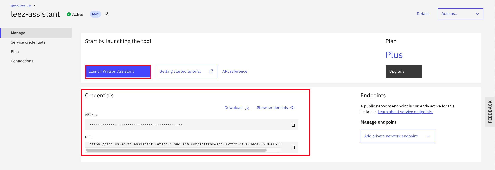
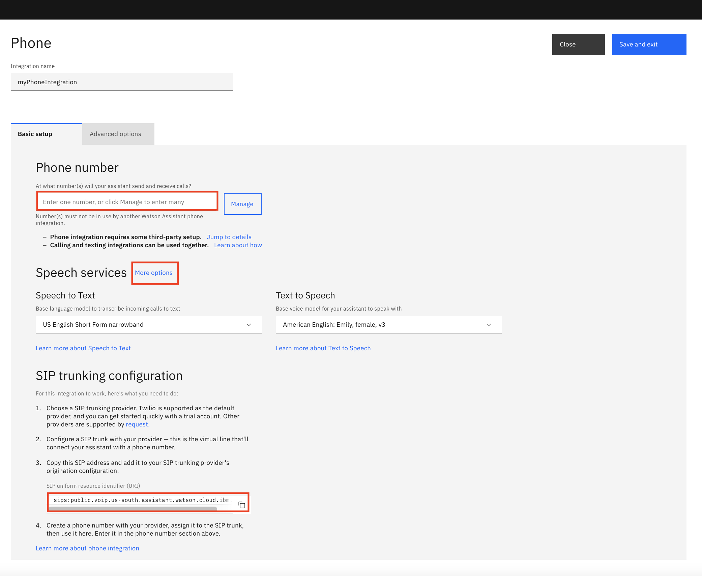
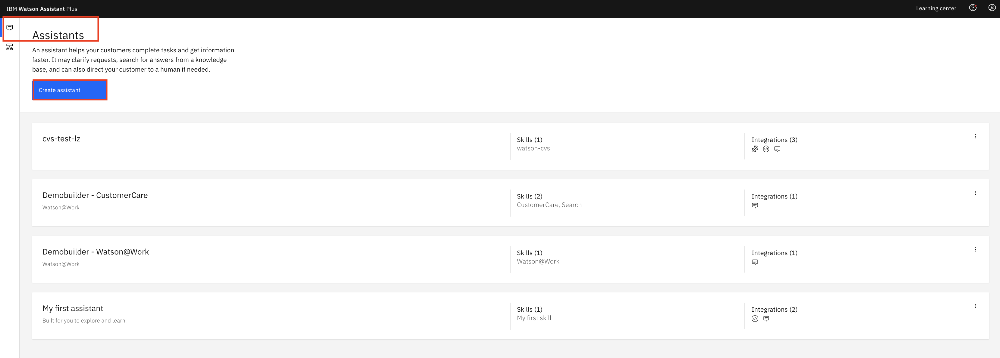
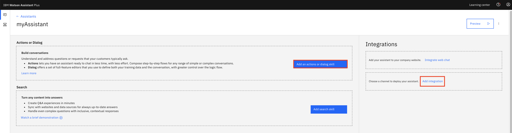
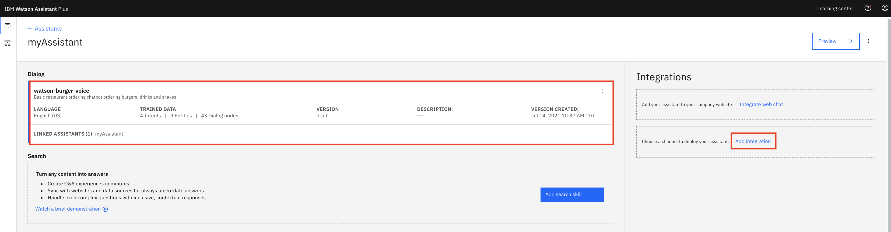
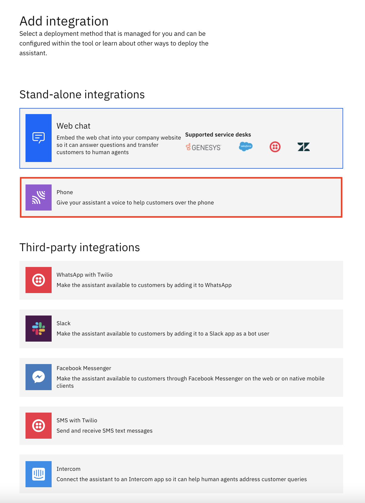
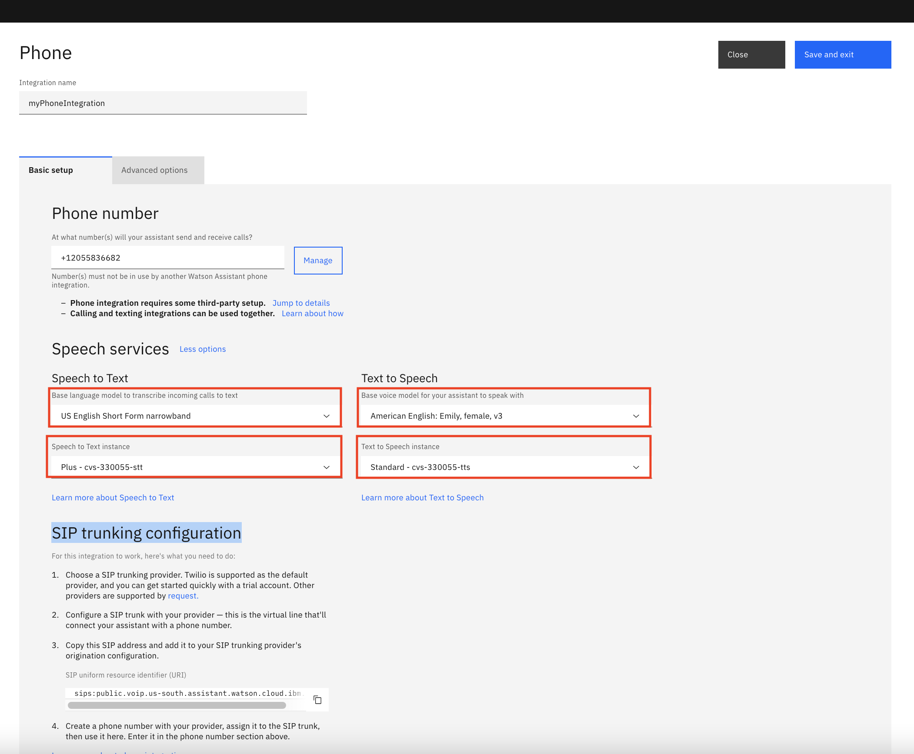
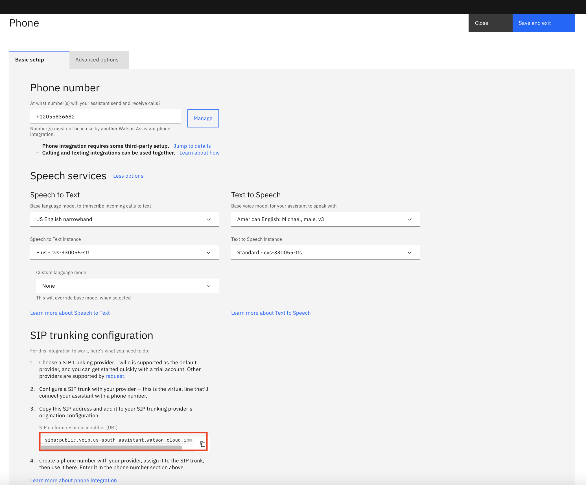

# Voicebot with Watson Services & Twilio - Watson Voice Integration

IBM Voice Integration with Watson services enables direct, automated voice interactions over the telephone between a cognitive agent and your customers. With Watson artificial intelligence at its backbone, your cognitive agent can communicate in a more conversational manner, and it can handle complex interactions that are difficult for traditional interactive voice response (IVR) systems.

IBM Voice Integration with Watson services helps you integrate a set of orchestrated Watson services with the telephone network by using the Session Initiation Protocol (SIP). 

This repo is part of Watson chatbot serial. The entire serial includes
* [Simple ChatBot](https://github.com/lee-zhg/watson-chatbot-simple.git)
* [Dressed-up ChatBot](https://github.com/lee-zhg/watson-chatbot-advanced.git)
* [Voice-Enabled ChatBot](https://github.com/lee-zhg/watson-voice-enabled-chatbot.git)
* [VoiceBot – Call and speak to ChatBot](https://github.com/lee-zhg/watson-voicebot.git) 


## Architecture and Components

Watson Voice Integration requires several components in the overall architecture of your environment, which can include the following elements:

* Voice Integration which works with the following Watson services:
    - `Watson Assistant` analyzes the text, maps it to intents, and provides a response according to a dialog that you create
    - `Speech to Text` converts the caller's audio into text
    - `Text to Speech` converts the text response into voice audio
* A SIP trunk, which connects your virtual agent to the telephone network
* An optional service orchestration engine (SOE), which sits between the Watson Assistant service and your agent so that you can further customize your environment


## Conversation Flow

The following diagram shows how Voice Integration with Watson orchestrates the various Watson services to create an cognitive agent. Within seconds, utterances flow between the services to result in a natural-sounding conversation with the caller. Voice Integration with Watson acts as a hub through which the caller and each Watson service communicate.


The following steps outline the conversation flow.

1. The caller calls helpdesk and asks a question.
1. The question is streamed to the Speech to Text service.
1. A text utterance is returned.
1. The text is sent to the Watson Assistant service as a message request.
1. A message response is returned.
1. The response text is sent to the Text to Speech service.
1. Synthesized audio is returned.
1. Voice Integration with Watson streams the audio response to the caller.


## SIP Trunk

You can use SIP trunks to quickly set up and test your environment from the public telephone network. When you connect to a agent through a SIP trunk, you must configure your SIP trunk to forward INVITE requests to the agent based on its IP address. You can find your Voice Integration with Watson SIP URI endpoint on the `Phone` integration page of Watson Assistance instance.

Calls flow through a SIP trunk to the agent, which communicates with Watson services though the API.


In addition to SIP trunk, you may choose different architecture when implementing the `Watson Voice Agent`. See detail at [Voice Agent with Watson](https://cloud.ibm.com/docs/voice-agent?topic=voice-agent-about#arch-sip). In this repo, `SIP Trunk` is used to illustrate the integration.


## Exercise Flow

Complete sections below to configure Watson Voice Integrate with a set of orchestrated Watson services and the telephone network by using the Session Initiation Protocol (SIP). 

### Step 1 - Clone the Repo

In a terminal, run:

```
$ git clone https://github.com/lee-zhg/watson-voicebot.git

$ cd watson-voicebot
```

We’ll be using the file [`data/skill-watson-burger-voice.json`](../../data/skill-watson-burger-voice.json) to upload the Assistant Intents, Entities, and Dialog Nodes. In addition, file [`data/skill-watson-photo.json`](../../data/skill-watson-photo.json) is also provided for your reference.


### Step 2 - Create Watson Assistant Service

`Watson Assistant` is the core component of the `Watson Voicebot`. Its intents, entities and dialog flows' configurations determine the covered subjects and conversation flows that the end users will experience when they call helpdesk.

If you have an existing `Watson Assistant` service, you may skip the rest of the section.

To create an instance of `Watson Assistant` service,

1. Login to [IBM Cloud](https://cloud.ibm.com).

1. Navigate to `Watson Assistant` catalog page (https://cloud.ibm.com/catalog/services/conversation).

1. Select `Lite`, `Plus Trial` or `Plus` plan.

1. Give a unique name.

1. Click `Create` button on the right.

1. Go to the `Manage` tab.

1. Record the service `API key` and `URL`.

    


### Step 3 - Configure Watson Assistant and Import Chatbot

You define `intents`, `entities` and `dialog flows` in your `Watson Assistant` instance. You may develop from scratch or import file [`data/skill-watson-burger-voice.json`](../../data/skill-watson-burger-voice.json) as a starting point.

1. Go to the `Manage` tab of your `Watson Assistant` instance and then click on `Launch Watson Assistant`.

1. Select the `Skills` tab in the left navigation tab.

1. Click `Create skill`

1. Select the `Dialog skill` option and then click `Next`.

1. Go to the `Import skill` tab.

1. Click the link `Drag and drop file here or click to select a file`.

1. Go to your cloned repo dir, and `Open` file [`data/skill-watson-burger-voice.json`](../../data/skill-watson-burger-voice.json).

1. Click `Import`.

Before you continue the rest of the exercise, you must have
* an instance of `Watson Assistant` service
* a skill `watson-burger-voice` defined in the above service


### Step 4 - Create Watson Speech to Text Service

`Watson Speech to Text` service takes the voice stream of the end users' input and transcribes to text which is subsequently passed to `Watson Assistant` service as a question or request to be fulfilled.

If you have an existing `Watson Speech to Text` service, you may skip the rest of the section.

To create an instance of `Watson Speech to Text` service,

1. Login to [IBM Cloud](https://cloud.ibm.com).

1. Navigate to `Watson Speech to text` catalog page (https://cloud.ibm.com/catalog/services/speech-to-text).

1. Select `Lite` or `Standard` plan.

1. Give a unique name.

1. Click `Create` button on the right.

1. Go to the `Manage` tab.

1. Record the service `API key` and `URL`.

    


### Step 5 - Create Watson Text to Speech Service

`Watson Text to Speech` service converts text messages from `Watson Assistant` service to audio, and then send back to the end user who initiated the call. 

If you have an existing `Watson Text to Speech` service, you may skip the rest of the section.

To create an instance of `Watson Text to Speech` service,

1. Login to [IBM Cloud](https://cloud.ibm.com).

1. Navigate to `Watson Text to Speech` catalog page (https://cloud.ibm.com/catalog/services/text-to-speech).

1. Select `Lite` or `Standard` plan.

1. Give a unique name.

1. Click `Create` button on the right.

1. Go to the `Manage` tab.

1. Record the service `API key` and `URL`.

    


### Step 6 - Configure Watson Voice Integration

The rest of the repo illustrates how to create a cognitive agent, built on top of Watson services, that integrates with the Twilio telephone network using the Session Initiation Protocol (SIP).


#### 6.1 - Setup a SIP Trunk for Voice Capabilities with Twilio

When you connect to a voice agent through a SIP trunk, you must configure your SIP trunk to forward INVITE requests to the agent based on its IP address. For `Voice Agent with Watson`, the `Primary Endpoint` on the Getting started page is the SIP URI endpoint that you would need when configuring Twilio account. You should have recorded the `Primary Endpoint` at the previous step.

1. Login to your Twilio account at https://www.twilio.com. If you don't have an account yet, you may create a free trial account.

    

1. Select `All Products & Services` in the most left pane to bring up the menu option.

    

1. Select the `Elastic SIP Trunking` option from the menu list.

    

1. Go to `Trunks` tab.

    

1. Click `Create new SIP Trunk` button.

1. Enter `Watson voice agent` as the `Friendly Name`.

1. Click `Create`.

    

1. Select the `Origination` tab.

    

1. Click `Add new Origination URI` button.

    

1. `SIP URI` information can be located in the `SIP trunking configuration` section of your `Watson Assistant Voice Integration` page(see the screen shot below). The subject will be covered in the coming section.

    

1. Click `Add`.

    


#### 6.2 - Cofigure Twilio Phone Number

When you created a Twilio trail account, a phone number is assigned to the account. After you configure the phone# with SIP trunk, the call to the phone# is forwarded to the `Voice Agent with Watson`. Then, the request will be handled by the chatbot based on `Watson Assistant`.

> **Note**: If you have a trial Twilio account, you must use the phone# that was used to sign up the trial Twilio account when you test the voicebot. If you call from any other phone# to the voicebot, it'll not trigger the voicebot.

1. Select `All Products & Services` in the most left pane to bring up the menu option.

1. Select the `Phone Numbers` option from the menu list.

1. Record the assigned Twilio phone#. It'll be used to configure `Voice Agent wit Watson` service in the next section.

1. Select the assigned Twilio phone#.

1. Scroll down to the `Voice` section.

    

1. For the field `CONFIGURE WITH` field, select `SIP Trunk`.

1. For the field `SIP Trunck`, select `Watson voice agent`.

    

1. Click `Save`.


#### Step 6.3 - Configure Watson Voice Integration

To configure Watson Voice Integration,

1. Login to IBM Cloud at https://cloud.ibm.com.

1. Find and open your `Watson Assistant` instance on the dashboard.

    

1. On the `Manage` tab, click `Launch Watson Assistant` button.

1. `Watson Assistant` window is launched in a new browser tab and you should land on the `Assistants` tab. If your `Watson Assistant` window has been open, you need to navigate to the `Assistants` tab to continue.

    

1. Select the `Create assistant` button.

    > Note: you should have created the skill `watson-burger-voice` in the previous section.

1. Enter `myAssistant` in the `Name` field and click `Create Assistant` button.

    

1. Select `Add an action or dialog skill` button.

1. Select your `dialog skill` tile. For example, `watson-burger-voice`.

    

1. Select the `Add integration` link.

    

1. A list of integration options is displayed. 

1. Select `Phone` tile.

1. Enter `myPhoneIntegration` in the `Integration name` field.

1. Select `Create`.

    

1. Enter your Twilio phone number (or from other provider). For exaple, +12055836682. Use digits only and add leading `+1`.

    > Note: The same phone# can only be used for one integration configuration. Otherwise, an error will show up.

1. Click the `More options` link next to `Speech services`. 

1. This action makes fields available for you to choose `Watson Speech to Text` and `Watson Text to Speech` instance.

    

1. Select proper `Watson Speech to Text` and `Watson Text to Speech` instance.

1. In the `Base language model to transcribe incoming calls to text` field, select a STT base model. For example, `US English narrowBand`.

1. In the `Base voice model for your assistant to speak with` field, select a TTS voice model. For example, `American English: Michael, male, v3`.

1. `SIP Trunk URI` in the `SIP trunking configuration` section is for your phone provider configuration. See detail in the previous section.

    

1. Select `Save and exit` on the top to save the configuration.


### Step 7 - Verification

Now, you completed the configuration of your cognitive agent.

To test your cognitive agent, if you have a `trial` Twilio account, you must make the call on the phone having the phone# that was used to register the trial Twilio account. This restriction does not apply if you have a paid Twilio account.

High level data flow is illustrated below.

1. When the Twilio system receives the call, it passed the voice stream to your `Watson Assistant Voice Integration` which then passes to the `Watson Speech to Text` service instance.

1. The `Watson Speech to Text` service instance transcribes the voice stream to text message and passes back to `Watson Assistant` service instance.

1. The chatbot based on the `Watson Assistant` service instance, accepts the text as a question or inquiry and response to it.

1. The chatbot response is passed to `Watson Text to Speech` service instance. The text messages are converted to voice and then is passed to `Watson Assistant Voice Integration` which passes the voice stream back to `Twilio`.

1. You start by calling and talking to Twilio, Watson completes a series of API calls and get a rreponse back to you in voice. A full cycle is completed.


#### Step 7.1 - If you are using dialog skill `skill-watson-burger-voice.json`

If you created your underline chatbot by importing dialog skill `skill-watson-burger-voice.json`, you may run the following test cases. Ordering burgers and drinks.

#### Test case #1

1. Dial your assigned Twilio phone#.

1. The voicebot picks up the call and greets you with welcome greeting.

1. You make the order by talking to voicebot `one big mac to go`.

1. Because all required information to order a burger has been provided, the voicebot grabs information and completes the order with response messages.

#### Test case #2

1. Dial your assigned Twilio phone#.

1. The voicebot picks up the call and greets you with welcome greeting.

1. You make 2nd order by talking to voicebot `one big mac please`.

1. Because dining location information to order a burger was not provided, the voicebot prompts you for the information.

1. After receiving all required information, the voicebot completes the order with response messages.

#### Test case #3

1. Dial your assigned Twilio phone#.

1. The voicebot picks up the call and greets you with welcome greeting.

1. You make the 3rd order by talking to voicebot `I like to order a small McFlurry with cookie`.

1. Because all required information to order a McFlurry has been provided, the voicebot grabs information and completes the order with response messages.


#### Step 7.2 - If you are using dialog skill `skill-watson-photo.json`

If you created your underline chatbot by importing dialog skill `skill-watson-photo.json`, you may run the following test cases. Printing photos and ordering drinks.

#### Test case #1

1. Dial your assigned Twilio phone#.

1. The voicebot picks up the call and greets you with welcome greeting.

1. You make the order by talking to voicebot `print 8x10 photos`.

1. Because all required information to complete an order has been provided, the voicebot grabs information and completes the order with response messages.

#### Test case #2

1. Dial your assigned Twilio phone#.

1. The voicebot picks up the call and greets you with welcome greeting.

1. You make 2nd order by talking to voicebot `I like to print photos`.

1. Because photo size information was not provided, the voicebot prompts you for the information.

1. After receiving all required information, the voicebot completes the order with response messages.

#### Test case #3

1. Dial your assigned Twilio phone#.

1. The voicebot picks up the call and greets you with welcome greeting.

1. You make the 3rd order by talking to voicebot `I like to have card service`.

1. Because all required information to complete the inquiry has been provided, the voicebot grabs information and completes the order with response messages.


#### Step 7.3 - If you have your own dialog skill

If you have your own dialog skill, you have the knowledge to develop your custom test cases.


## Links

* [Getting started with Voice Agent with Watson](https://cloud.ibm.com/docs/voice-agent?topic=voice-agent-getting-started)
* [Voice Agent with Watson Docs](https://cloud.ibm.com/docs/voice-agent?topic=voice-agent-about)
* [Demo](https://www.youtube.com/watch?v=ztOme26gVuA)

## Learn more

* **Artificial Intelligence Code Patterns**: Enjoyed this Code Pattern? Check out our other [AI Code Patterns](https://developer.ibm.com/technologies/artificial-intelligence/).
* **AI and Data Code Pattern Playlist**: Bookmark our [playlist](https://www.youtube.com/playlist?list=PLzUbsvIyrNfknNewObx5N7uGZ5FKH0Fde) with all of our Code Pattern videos
* **With Watson**: Want to take your Watson app to the next level? Looking to utilize Watson Brand assets? [Join the With Watson program](https://www.ibm.com/watson/with-watson/) to leverage exclusive brand, marketing, and tech resources to amplify and accelerate your Watson embedded commercial solution.
* **Kubernetes on IBM Cloud**: Deliver your apps with the combined the power of [Kubernetes and Docker on IBM Cloud](https://www.ibm.com/cloud/container-service)
