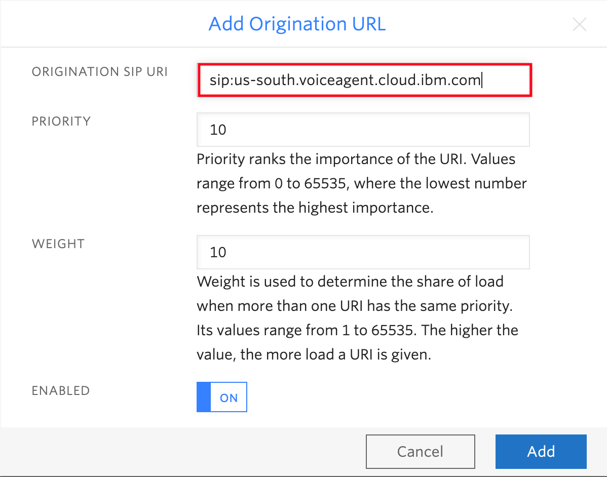

# Voicebot with Watson Services & Twilio - Watson Voice Agent

IBM Voice Agent with Watso enables direct, automated voice interactions over the telephone between a cognitive agent and your customers. With Watson artificial intelligence at its backbone, your agent can communicate in a more conversational manner, and it can handle complex interactions that are difficult for traditional interactive voice response (IVR) systems.

IBM Voice Agent with Watsons helps you integrate a set of orchestrated Watson services with the telephone network by using the Session Initiation Protocol (SIP). 

This repo is part of Watson chatbot serial. The entire serial includes
* [Simple ChatBot](https://github.com/lee-zhg/watson-chatbot-simple.git)
* [Dressed-up ChatBot](https://github.com/lee-zhg/watson-chatbot-advanced.git)
* [Voice-Enabled ChatBot](https://github.com/lee-zhg/watson-voice-enabled-chatbot.git)
* [VoiceBot – Call and speak to ChatBot](https://github.com/lee-zhg/watson-voicebot.git) 

## Architecture and Components

Voice Agent with Watson is one of several components in the overall architecture of your environment, which can include the following elements:

* An agent based on IBM Voice Gateway External link icon, which orchestrates the following Watson services:
    - Speech to Text External link icon: Converts the caller's audio into text
    - Watson Assistant External link icon: Analyzes the text, maps it to intents, and provides a response according to a dialog that you create
    - Text to Speech External link icon: Converts the response into voice audio
* A SIP trunk, which connects your agent to the telephone network
* An optional service orchestration engine (SOE), which sits between the Watson Assistant service and your agent so that you can further customize your environment

## Conversation Flow

The following diagram shows how Voice Agent with Watson orchestrates the various Watson services to create an agent. Within seconds, utterances flow between the services to result in a natural-sounding conversation with the caller.
Voice Agent with Watson acts as a hub through which the caller and each Watson service communicate.

The following steps outline the conversation flow.

1. The caller calls helpdesk and asks a question.
1. The question is streamed to the Speech to Text service.
1. A text utterance is returned.
1. The text is sent to the Watson Assistant service as a message request.
1. A message response is returned.
1. The response text is sent to the Text to Speech service.
1. Synthesized audio is returned.
1. Voice Agent with Watson streams the audio response to the caller.

## SIP Trunk

You can use SIP trunks to quickly set up and test your environment from the public telephone network. When you connect to a agent through a SIP trunk, you must configure your SIP trunk to forward INVITE requests to the agent based on its IP address. You can find your Voice Agent with Watson SIP URI endpoint on the Getting started page.

Calls flow through a SIP trunk to the agent, which communicates with Watson services though the API.

In addition to SIP trunk, you may choose different architecture when implementing the `Watson Voice Agent`. See detail at [Voice Agent with Watson](https://cloud.ibm.com/docs/voice-agent?topic=voice-agent-about#arch-sip). In this repo, `SIP Trunk` is used to illustrate the integration.

## Exercise Flow

Complete sections below to configure Watson Voice Agent to integrate a set of orchestrated Watson services with the telephone network by using the Session Initiation Protocol (SIP). 

### Step 1 - Create and Configure Watson Assistant Service

`Watson Assistant` is the core component of the `Watson Voicebot`. Its intents, entities and dialog flows' configurations determine the covered subjects and conversation flows that the end users will experience when they call helpdesk.

If you have not completed the exercise of [Basic Burger Ordering Chatbot with Watson Assistant Service](https://github.com/lee-zhg/watson-chatbot-simple.git), go ahead and complete it. At minimal, you need to complete steps in [Run locally](https://github.com/lee-zhg/watson-chatbot-simple/blob/master/doc/source/local.md). The exercise guides you to create an instance of `Watson Assistant` and creates a skill `watson-burger-simple`.

Before you continue the rest of the exercise, you must have
* an instance of `Watson Assistant` service
* a skill `watson-burger-simple` defined in the above service

### Step 2 - Create Watson Speech to Text Service

`Watson Speech to Text` service takes the voice stream of the end users' input and transcribes to text which is subsequently passed to `Watson Assistant` service as a question or request to be fulfilled.

If you have an existing `Watson Speech to Text` service, you may skip the rest of the section.

To create an instance of `Watson Speech to Text` service,

1. Login to [IBM Cloud](https://cloud.ibm.com).

1. Navigate to `Watson Speech to text` catalog page (https://cloud.ibm.com/catalog/services/speech-to-text).

1. Select `Lite` or `Standard` plan.

1. Give a unique name.

1. Click `Create` button on the right.

1. Go to the `Manage` tab.

1. Record the service `API key` and `URL`.

    

### Step 3 - Create Watson Text to Speech Service

`Watson Text to Speech` service converts text messages from `Watson Assistant` service to audio, and then send back to the end user who initiated the call. 

If you have an existing `Watson Text to Speech` service, you may skip the rest of the section.

To create an instance of `Watson Text to Speech` service,

1. Login to [IBM Cloud](https://cloud.ibm.com).

1. Navigate to `Watson Text to Speech` catalog page (https://cloud.ibm.com/catalog/services/text-to-speech).

1. Select `Lite` or `Standard` plan.

1. Give a unique name.

1. Click `Create` button on the right.

1. Go to the `Manage` tab.

1. Record the service `API key` and `URL`.

    

### Step 4 - Create Voice Agent with Watson Service

`Voice Agent with Watson` service is the another core component of the `Watson Voicebot`. This component integrates all Watson services and your telephony system and makes the voicebot as a single working unit.

To create an instance of `Voice Agent with Watson` service,

1. Login to [IBM Cloud](https://cloud.ibm.com).

1. Navigate to `Voice Agent with Watson` catalog page (https://cloud.ibm.com/catalog/services/voice-agent-with-watson).

1. Select `Lite` or `Standard` plan.

1. Give a unique name.

1. Click `Create` button on the right.

1. Go to the `Manage` tab.

1. Record the service `Primary Endpoint` on the right.

    

1. In the left pane, the steps and instructions to configure the `voice agent` present.

### Step 5 -  Comnfigure Cognitive Agent

The rest of the repo illustrates how to create a cognitive agent, built on top of Watson services, that integrates with the Twilio telephone network using the Session Initiation Protocol (SIP).

#### 5.1 - Setup a SIP Trunk for Voice Capabilities with Twilio

When you connect to a voice agent through a SIP trunk, you must configure your SIP trunk to forward INVITE requests to the agent based on its IP address. For `Voice Agent with Watson`, the `Primary Endpoint` on the Getting started page is the SIP URI endpoint that you would need when configuring Twilio account. You should have recorded the `Primary Endpoint` at the previous step.

1. Login to your Twilio account at https://www.twilio.com. If you don't have an account yet, you may create a free trial account.

    

1. Select `All Products & Services` in the most left pane to bring up the menu option.

    

1. Select the `Elastic SIP Trunking` option from the menu list.

    

1. Go to `Trunks` tab.

    

1. Click `Create new SIP Trunk` button.

1. Enter `Watson voice agent` as the `Friendly Name`.

1. Click `Create`.

    

1. Select the `Origination` tab.

    

1. Click `Add new Origination URI` button.

    

1. Copy and paste the `Primary Endpoint` from your `Voice Agent with Watson` instance.

1. Click `Add`.

    

#### 5.2 - Cofigure Twilio Phone Number

When you created a Twilio trail account, a phone number is assigned to the account. After you configure the phone# with SIP trunk, the call to the phone# is forwarded to the `Voice Agent with Watson`. Then, the request will be handled by the chatbot based on `Watson Assistant`.

> **Note**: If you have a trial Twilio account, you must use the phone# that was used to sign up the trial Twilio account when you test the voicebot. If you call from any other phone# to the voicebot, it'll not trigger the voicebot.

1. Select `All Products & Services` in the most left pane to bring up the menu option.

1. Select the `Phone Numbers` option from the menu list.

1. Record the assigned Twilio phone#. It'll be used to configure `Voice Agent wit Watson` service in the next section.

1. Select the assigned Twilio phone#.

1. Scroll down to the `Voice` section.

    

1. For the field `CONFIGURE WITH` field, select `SIP Trunk`.

1. For the field `SIP Trunck`, select `Watson voice agent`.

    

1. Click `Save`.

#### Step 5.3 - Connect your Voice Agent with Watson to your Watson Services

To connect your `Voice Agent with Watson` to your Watson Services,

1. Login to IBM Cloud at https://cloud.ibm.com.

1. Find and open your instance of `Voice Agent with Watson` service on the dashboard.

    

1. Go to `Manage` tab.

1. Click `Create an agent` button.

    

1. Make sure `Voice` agent type is selected.

1. Enter `my voicebot` in the `Name` field.

1. Enter the Twilio phone# in the `Phone number(s)` field.

    

1. Scroll down to the `Conversation` section.

1. Make sure `My Watson Assistant service instance` is selected as `Service type`.

1. Select your `Watson Assistant` instance in the `Service instance` field.

1. Select `watson-burger-simple/......` as the `Skill name`.

    > **Note**: you must select `watson-burger-simple/......`. Skill `wstson-burger-advanced` does not work as its dialog flow contains HTTP tags that `Watson Speech to Text` service can't process.

    

1. Scroll down to the `Speech to Text` section.

1. Make sure that the `My Speech to Text service instance` is selected as `Service type`.

1. Select your `Service instance`.

1. Select `Broadband` in the `Select model type` field.

1. Select `en-US BroadbankModel: US English broadband model` as the `Model`.

1. Click `Show advanced` link to expand the section.

1. In the `Custom language model (broadband)` field, select your custom model if you have any.

    

1. Scroll down to the `Text to Speech` section.

1. Make sure that the `My Text to Speech service instance` is selected as `Service type`.

1. Select your `Service instance`.

1. Optionally, you may choose a different `Voice`.

    

### Step 6 - Dial and Make Order

Now, you completed the configuration of your voicebot, or cognitive agent.

To test your voicebot, you must use the phone# that was used to register the trial Twilio account when you call your assigned Twilio phone#. 

1. When the Twilio system receives the call, it passed the voice stream to your `Voice Agent with Watson` instance which then passes to the `Watson Speech to Text` service instance.

1. The `Watson Speech to Text` service instance transcribes the voice stream to text message and passes to `Watson Assistant` service instance.

1. The chatbot based on the `Watson Assistant` service instance, accepts the text as a question or inquiry and response to it.

1. The chatbot response is passed to `Watson Text to Speech` service instance. The text messages are converted to voice and then is passed to `Voice Agent with Watson` which passes the voice stream back to `Twilio`.

1. You start by calling and talking to Twilio, Watson completes a series of API calls and get a rreponse back to you in voice. A full cycle is completed.

For example, you can make the following oders.

#### Order #1

1. Dial you assigned Twilio phone#.

1. The voicebot picks up the call and greets you with welcome greeting.

1. You make the order by talking to voicebot `one big mac to go`.

1. Because all required information to order a burger has been provided, the voicebot grabs information and completes the order with response messages.

#### Order #2

1. Dial you assigned Twilio phone#.

1. The voicebot picks up the call and greets you with welcome greeting.

1. You make 2nd order by talking to voicebot `one big mac please`.

1. Because dining location information to order a burger was not provided, the voicebot prompts you for the iinformation.

1. After receiving all required information, the voicebot completes the order with response messages.

#### Order #3

1. Dial you assigned Twilio phone#.

1. The voicebot picks up the call and greets you with welcome greeting.

1. You make the 3rd order by talking to voicebot `I like to order a small McFlurry with cooky`.

1. Because all required information to order a McFlurry has been provided, the voicebot grabs information and completes the order with response messages.

## Links

* [Getting started with Voice Agent with Watson](https://cloud.ibm.com/docs/voice-agent?topic=voice-agent-getting-started)
* [Voice Agent with Watson Docs](https://cloud.ibm.com/docs/voice-agent?topic=voice-agent-about)
* [Demo](https://www.youtube.com/watch?v=ztOme26gVuA)

## Learn more

* **Artificial Intelligence Code Patterns**: Enjoyed this Code Pattern? Check out our other [AI Code Patterns](https://developer.ibm.com/technologies/artificial-intelligence/).
* **AI and Data Code Pattern Playlist**: Bookmark our [playlist](https://www.youtube.com/playlist?list=PLzUbsvIyrNfknNewObx5N7uGZ5FKH0Fde) with all of our Code Pattern videos
* **With Watson**: Want to take your Watson app to the next level? Looking to utilize Watson Brand assets? [Join the With Watson program](https://www.ibm.com/watson/with-watson/) to leverage exclusive brand, marketing, and tech resources to amplify and accelerate your Watson embedded commercial solution.
* **Kubernetes on IBM Cloud**: Deliver your apps with the combined the power of [Kubernetes and Docker on IBM Cloud](https://www.ibm.com/cloud/container-service)
