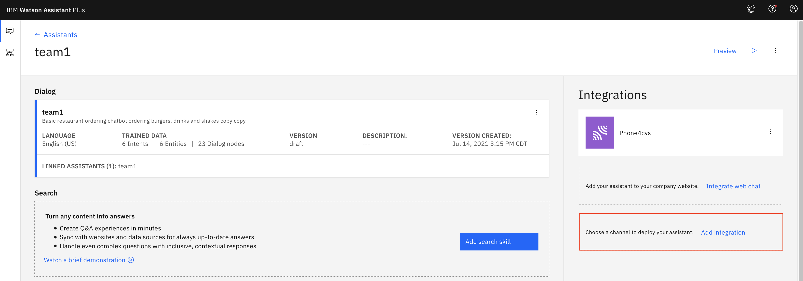
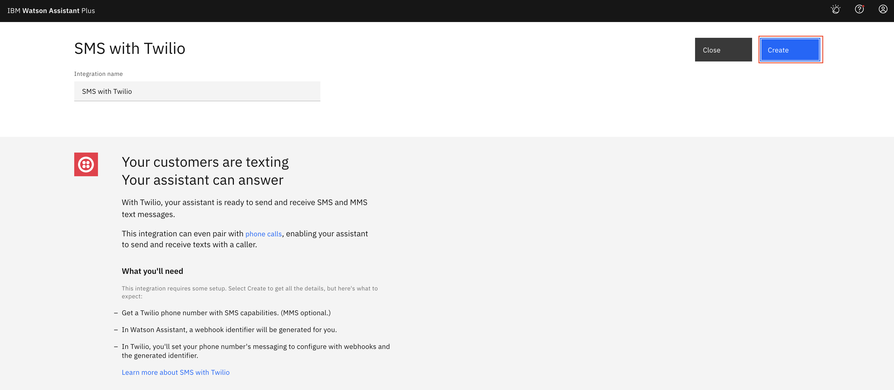
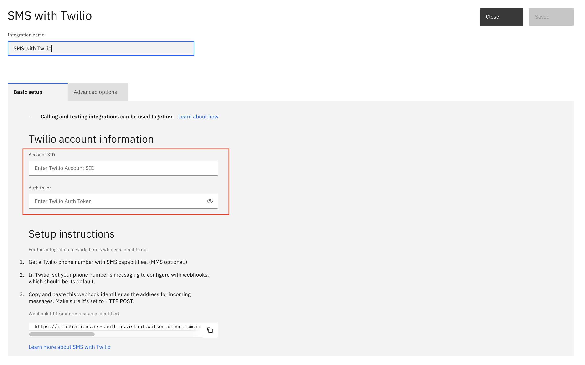
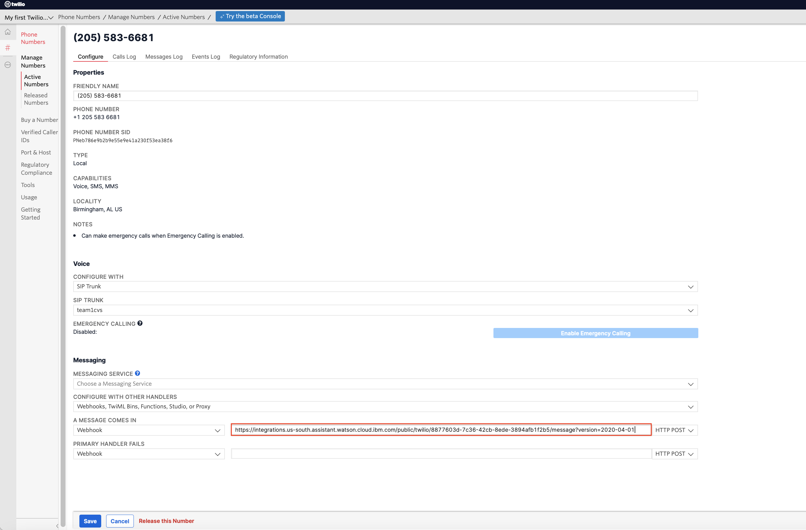

# Integrating Watson Assistant with SMS via Twilio

Add a text messaging integration so your assistant can exchange messages with your customers.

The Short Messaging Service (SMS) supports text-only messages. Typically, SMS restricts the text message length to 160 characters. The Multimedia Messaging Service (MMS) supports sending images and text messages that are over 160 characters in length. When you create a phone number with Twilio, MMS message support is included automatically.

Customers send text messages to your Twilio-hosted phone number. Twilio uses a messaging webhook that you set up to send a POST request with the text message body to your assistant. Each response from the assistant is sent back to Twilio to be converted to an outbound SMS message that is sent to the customer. The responses are sent to the Twilio API for processing. You provide your Twilio account SID and project authentication token information, which serve as your Twilio API access credentials.

The integration currently does not support the following functions:
- Starting an SMS-only interaction with an outgoing text
- Configuring backup locations
- Reviewing the usage summary page. Use IBM Log Analysis instead. For more information, see Viewing logs.

## Steps

Complete the steps below to configure Watson Assistant MSM integration with Twilio.

### Retrieve Twilio Information

1. Login to your Twilio account at https://www.twilio.com. If you don't have an account yet, you may create a free trial account.

1. Click the home icon to go to your project dashboard.

    

1. Take note of the value of `Account SID` and `Auth token`. You will need both values for later.

### Configure Watson Assistant

To integrate Watson Assistant with SMS via Twilio,

1. Login to IBM Cloud.

1. Search and locate the Watson Assistant instance.

1. Open the instance.

1. Select `Launch Watson Assistant` button on the `Manage` tab.

1. On the `Assistants` tab of the Watson Assistant window, select your assistant tile.

1. From the Integrations section, click `Add integration`.

  

1. Click `SMS with Twilio`.

  

1. Click `Create`.

  

1. Eneter values in the field `Account SID` and `Auth token`. You should have retrieved the information in the previous section.

1. Scroll to the `Setup instructions` section, and take note of the value in the `Webhook URI (uniform resource identifier)` field. The information will be used to set the webhook configuration in Twilio. 

  > Note: If you want to support more than one phone number, you must add the URI to the webhook for each phone number separately.

1. Select `Save and exit` button. 

### Configure Twilio

1. Go to your Twilio account web page. 

1. Select `All Products & Services` in the most left pane to bring up the menu option.

1. Select the `Phone Numbers` option from the menu list.

1. Select the your Twilio phone# on the `Active Numbers` tab.

1. Scroll to the `Messaging section`, and then find the `Webhook` field. It defines what to do when a message comes in.

    

1. Enter the value from the previous section in the `Webhook` field.

  > Note: If you want to support multiple phone numbers, repeat the previous step for each phone number that you want to use.

1. Save.

If you want your assistant to be able to switch between voice and text during a customer interaction, configure both the phone and text messaging integrations. The integrations do not need to use the same third-party service provider. 

## Verification

For a quick verification, you may import the skill `skill-watson-burger-voice.json` or `skill-watson-photo.json` into your Watson Assistant instance.

### Test #1

1. Text `hi` to you assigned Twilio phone#.

1. The chatbot replies with welcome greeting.

1. You text `print 4x6 photos in matte finish`.

1. Because chatbot received all required information to complete the conversation, it replies with `A 4 by 6 photo in matte finish would cost $5`.

### Test #2

1. Text `hello` to you assigned Twilio phone#.

1. The chatbot replies with welcome greeting.

1. You text `print 8x10 photos`.

1. The chatbot replies `What kind of finish do you want?`, because photo finish information was not provided.

1. You text `matte`.

1. The chatbot replies `A 8 by 10 photo in matte finish would cost $5.`

### Test #3

1. Text `hello` to you assigned Twilio phone#.

1. The chatbot replies with welcome greeting.

1. You text `print photos in glossy finish`.

1. The chatbot replies `What size photo do you want to print?`, because photo size information was not provided.

1. You text `matte`.

1. The chatbot replies `A 5 by 7 photo in gloss finish would cost $5.`

