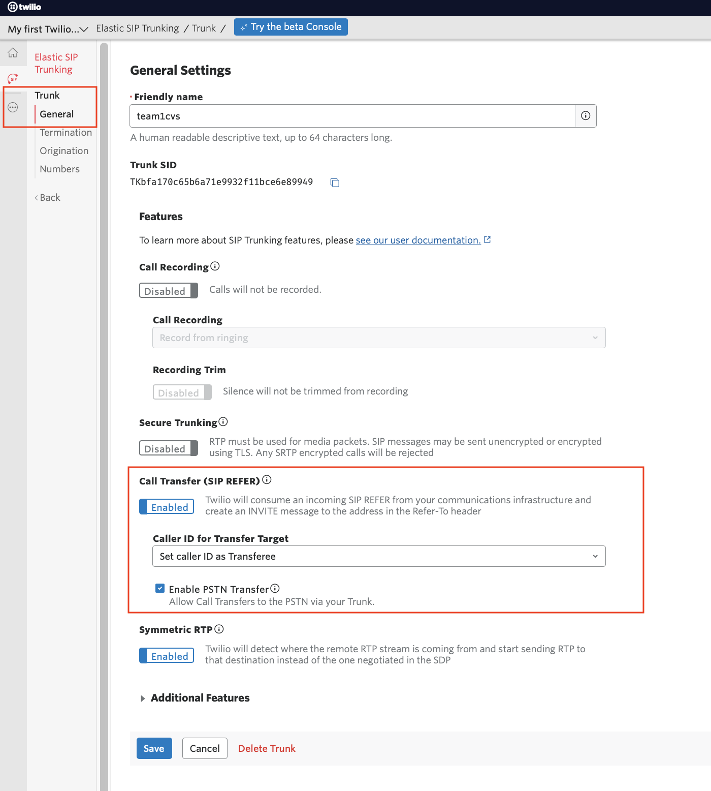

# Enable transfer call to live agent for Watson Assistant Phone Integration


To enable transfer call to live agent for Watson Assistant Phone Integration, 2 tasks must be completed
* configure Twilio account
* configure Watson Assistant


## I. Configure Twilio account

To enable Twilio transfer capability, 2 features must be enabled on "General Settings" tab of "Trunk" on Twilio UI,
* Call Transfer (SIP REFER)
* Enable PSTN Transfer




## II. Configure Watson Assistant

JSON codes are required on the node where the call transfer occurs.


### Transfer to a Phone#

Sample JSON code when transferring to a specific phone#,

```
{
  "output": {
    "text": {
      "values": [
        "Transferring your call to a representative."
      ],
      "selection_policy": "sequential"
    },
    "vgwAction": {
      "command": "vgwActTransfer",
      "parameters": {
        "transferHeader": "User-to-User",
        "transferTarget": "tel:+12144220200"
      }
    }
  }
}
```


### Transfer to a Telephony Provider SIP Trunk

Sample JSON code when transferring to a telephony provider SIP trunk,

```
{
  "output": {
    "text": {
      "values": [
        "Transferring your call to a representative."
      ],
      "selection_policy": "sequential"
    },
    "vgwAction": {
      "command": "vgwActTransfer",
      "parameters": {
        "transferHeader": "User-to-User",
        "transferTarget": "sip:gscfsbmx\\@siptest012.onsip.com"
      }
    }
  }
}
```


